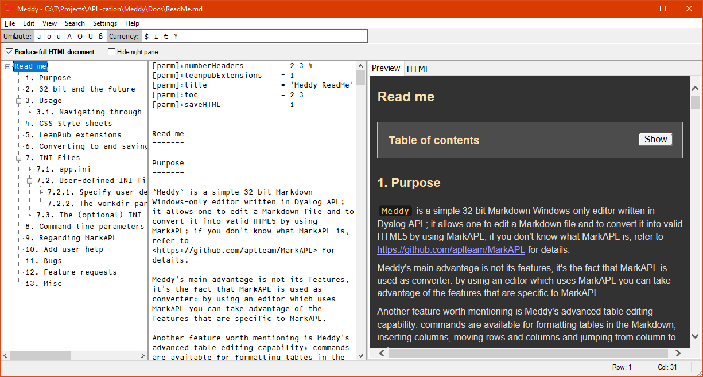

# Meddy

_**Meddy**_ is a Markdown editor. It uses the [MarkAPL class](http://github.com/aplteam/MarkAPL) to convert Markdown to valid HTML5.

_**Meddy**_ is a Windows-only GUI application written in Dyalog APL 18.0 Unicode 32-bit which is available as a stand-alone EXE. 

* Supports all MarkAPL features; for details see <https://github.com/aplteam/MarkAPL>
* Allows navigating via the TreeView representing all headers
* Powerful search and replace functionality
* Allows injecting complex Markdown expressions via the context menu
