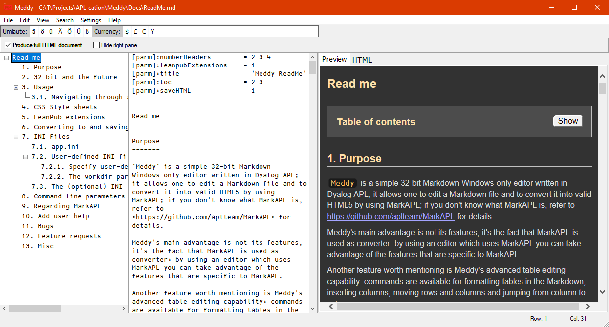

# Meddy

_**Meddy**_ is a Markdown editor. It uses the [MarkAPL class](http://github.com/aplteam/MarkAPL) to convert Markdown to valid HTML5.

Until (and including) version 5.* **Meddy**_ is a Windows-only GUI application written in Dyalog APL 20.0 Unicode 64-bit which is available as a stand-alone EXE.

With version 6.0.0, to be releases in 2026, Meddy will be a multi-platform application available on Windows, Linux and Mac-OS.

* Supports all MarkAPL features; for details see <https://github.com/aplteam/MarkAPL>
* Allows navigating via the TreeView representing all headers
* Powerful search and replace functionality
* Allows injecting complex Markdown expressions via the context menu
* Advanced table formatting and editing
